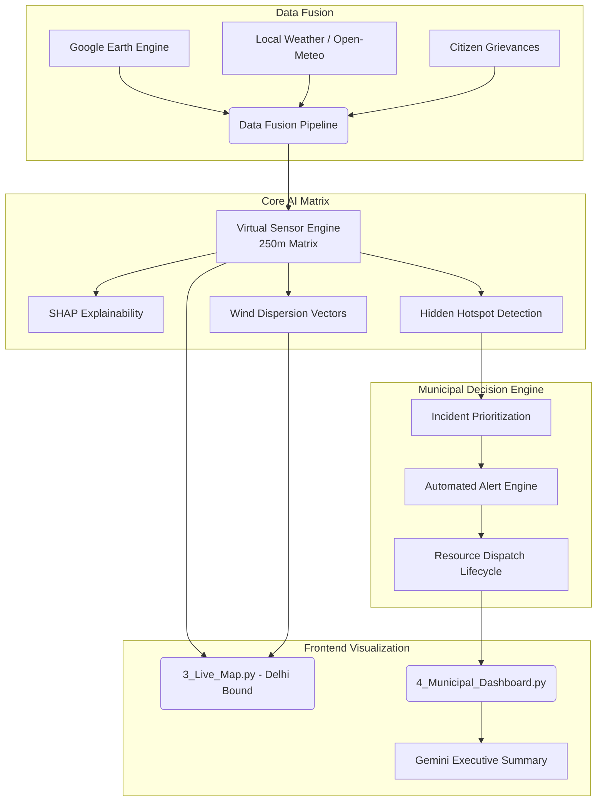

# 🔍 DELHI DIGITAL TWIN AUDIT REPORT

## 1. Map Mount Points & Coordinate Checking
The visual representation of the Digital Twin relies heavily on an isolated Google Maps instance injected via Streamlit.
- **Mount Point:** `pages/3_Live_Map.py` handles the primary injection. It uses `streamlit.components.v1.html` to mount a custom Google Maps HTML/JS bundle located in `frontend/google_maps/`.
- **Coordinate Checking & Bound Generation:** The coordinates are statically constrained in `pages/3_Live_Map.py` around the Delhi NCR region:
  ```python
  grid = map_service.generate_grid_for_bounds(
      north=28.9, south=28.3, east=77.5, west=76.8, 
      resolution_meters=250
  )
  ```
  This is passed as `window.MAP_DATA` to the client-side JavaScript. 

## 2. ML Services, Hooks, and Pipeline Endpoints
The backend encapsulates the Data Fusion and ML execution via several core engines:
- **`backend/services/virtual_sensor_engine.py`:** The primary inference coordinator. It accepts `(lat, lon)` arrays, requests data from upstream services, and outputs a Pydantic object `VirtualSensorEstimate`.
- **`backend/services/data_fusion.py`:** Fetches multimodal inputs by communicating with:
  - `backend/satellite/gee_service.py` (Google Earth Engine for AOD, NO2, Thermal anomalies).
  - External weather APIs (Open-Meteo).
  - The local SQLite/in-memory DB for citizen reports.
- **`backend/ml/xai.py` & `backend/ml/attribution.py`:** Provides SHAP-based feature importance to calculate dominant pollution sources for any given grid coordinate.
- **`backend/forecast/dispersion_engine.py`:** Calculates convective plume movements and pollution spread using a Gaussian dispersion model.

## 3. Structural Blueprint for Phase 2 Downstream Data Passes
To fully isolate the Digital Twin to Delhi and enact operational municipal workflows, the data will flow as follows:



### Proposed Phase 2 Implementation Steps:
1. **Frontend Map Clipping:** Modify `frontend/google_maps/map.js` to enforce `restriction: { latLngBounds: DELHI_BOUNDS }` in the Google Maps initialization.
2. **Backend Optimization:** Upgrade the `VirtualSensorEngine` to process the entire 250m grid array iteratively, computing localized SHAP values and detecting hidden hotspots.
3. **Municipal Workflows:** Build the `Incident Prioritization Engine` and `Gemini Report Generator` directly into `pages/4_Municipal_Dashboard.py`.
